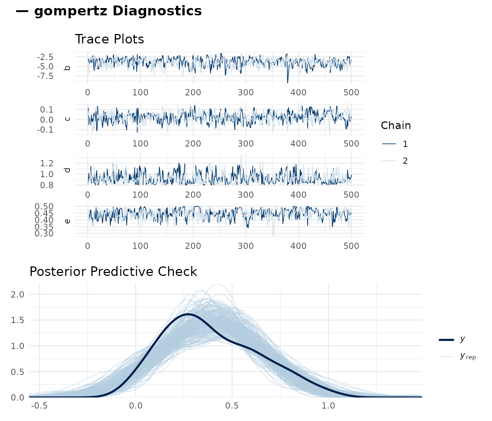
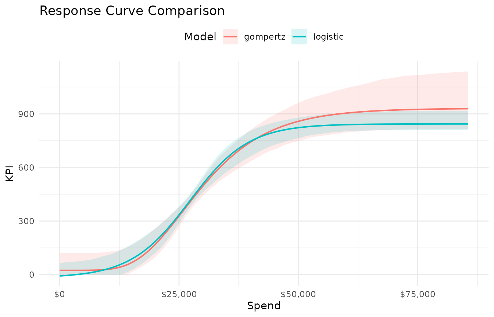
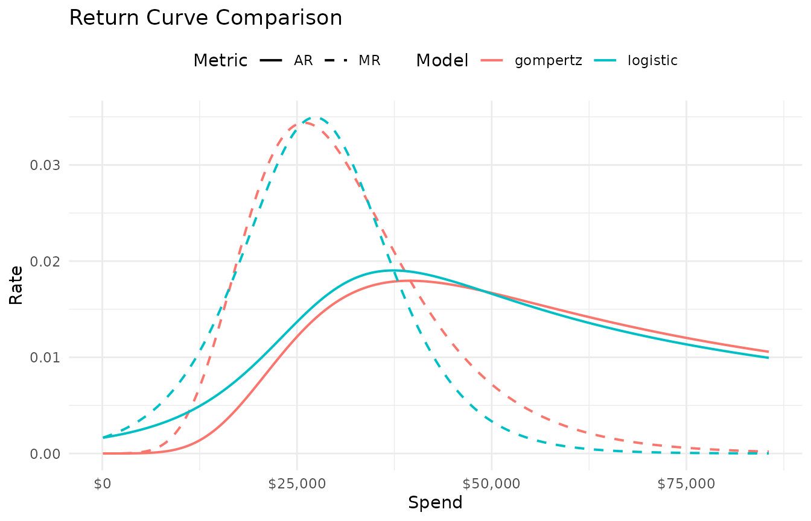
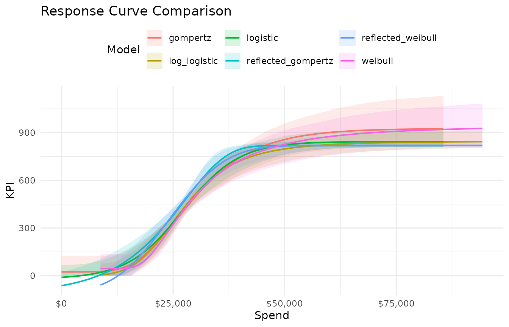

# Diagnostics and Model Comparison

Fitting a response curve is the easy part. Knowing whether the fit is
trustworthy requires checking convergence diagnostics, evaluating
predictive performance, and comparing candidate curve types. This
vignette covers the full diagnostic and comparison workflow.

------------------------------------------------------------------------

## Fit two candidate models

We’ll work with the Paid Social channel from `mrmopt_data`, comparing a
Gompertz and a logistic curve:

``` r

social_data <- mrmopt_data |> filter(channel == "Paid Social")

fit_gomp <- fit_response(
  data           = social_data,
  spend          = "spend",
  kpi            = "conversions",
  date           = "week",
  type           = "gompertz",
  midpoint_range = c(0.1, 0.5),
  ceiling_max    = 3,
  refresh        = 0,
  iter = 1000,
  chains = 2
)
#> conversions ~ c + (d - c) * exp(-exp(b * (spend - e))) 
#> b ~ 1
#> c ~ 1
#> d ~ 1
#> e ~ 1

fit_logistic <- fit_response(
  data           = social_data,
  spend          = "spend",
  kpi            = "conversions",
  date           = "week",
  type           = "logistic",
  midpoint_range = c(0.1, 0.5),
  ceiling_max    = 3,
  refresh        = 0,
  iter = 1000,
  chains = 2
)
#> conversions ~ c + ((d - c)/(1 + exp(b * (spend - e)))) 
#> b ~ 1
#> c ~ 1
#> d ~ 1
#> e ~ 1
```

------------------------------------------------------------------------

## Step 1: MCMC convergence

Before interpreting any results, verify that the sampler converged. A
model that hasn’t converged can produce arbitrarily wrong parameter
estimates.

### Trace plots

[`mrm_plot_diagnostics()`](https://bdshaff.github.io/mrmopt/reference/mrm_plot_diagnostics.md)
produces trace plots for the four curve parameters plus a posterior
predictive check:

``` r

mrm_plot_diagnostics(fit_gomp)
```



Note: An `mrmfit` object is a `brms` object so further diagnostics with
functions from `bayesplot` will work as expected

``` r

class(fit_logistic)
#> [1] "mrmfit"  "brmsfit"
```

**What to look for in trace plots:**

- **Good**: Chains overlap completely, forming a “fuzzy caterpillar.” No
  trends, no drift, no one chain stuck in a different region.
- **Bad**: Chains that separate (bimodal posterior), chains that trend
  upward or downward (haven’t converged), or chains that get stuck in
  one region for many iterations (poor mixing).

### Numerical diagnostics: Rhat and ESS

The [`summary()`](https://rdrr.io/r/base/summary.html) method reports
Rhat and Bulk ESS for each parameter:

``` r

summary(fit_gomp)
#>  Family: gaussian 
#>   Links: mu = identity 
#> Formula: conversions ~ c + (d - c) * exp(-exp(b * (spend - e))) 
#>          b ~ 1
#>          c ~ 1
#>          d ~ 1
#>          e ~ 1
#>    Data: data (Number of observations: 104) 
#>   Draws: 2 chains, each with iter = 1000; warmup = 500; thin = 1;
#>          total post-warmup draws = 1000
#> 
#> Regression Coefficients:
#>             Estimate Est.Error l-95% CI u-95% CI Rhat Bulk_ESS Tail_ESS
#> b_Intercept    -3.96      1.13    -6.41    -2.15 1.00      480      540
#> c_Intercept     0.02      0.05    -0.08     0.12 1.00      418      546
#> d_Intercept     0.92      0.10     0.81     1.15 1.00      443      596
#> e_Intercept     0.45      0.04     0.37     0.50 1.00      307      217
#> 
#> Further Distributional Parameters:
#>       Estimate Est.Error l-95% CI u-95% CI Rhat Bulk_ESS Tail_ESS
#> sigma     0.20      0.01     0.17     0.22 1.00      650      531
#> 
#> Draws were sampled using sampling(NUTS). For each parameter, Bulk_ESS
#> and Tail_ESS are effective sample size measures, and Rhat is the potential
#> scale reduction factor on split chains (at convergence, Rhat = 1).
```

**Targets:**

| Diagnostic | Target | Concern |
|----|----|----|
| Rhat | ≤ 1.01 | Values above 1.01 indicate chains haven’t converged to the same distribution |
| Bulk ESS | \> 400 | Below 400, posterior summaries (means, quantiles) may be unreliable |
| Tail ESS | \> 400 | Low tail ESS means credible interval endpoints are unstable |

If Rhat \> 1.01 for any parameter, do not trust the results. Increase
`iter` and `warmup`, or adjust priors (see [Priors and Model
Tuning](https://bdshaff.github.io/mrmopt/articles/priors_and_tuning.md)).

------------------------------------------------------------------------

## Step 2: Posterior predictive check

The bottom panel of
[`mrm_plot_diagnostics()`](https://bdshaff.github.io/mrmopt/reference/mrm_plot_diagnostics.md)
shows a **posterior predictive check** (PPC). This compares the observed
data distribution to data simulated from the fitted model.

**What to look for:**

- **Good**: The blue posterior draws envelope the black observed-data
  line. The overall shape and spread match.
- **Bad**: A systematic shift (model predicts higher/lower than
  observed), a shape mismatch (model is unimodal but data is bimodal),
  or the observed data falls outside the posterior draws entirely.

A PPC failure usually means the curve form is wrong for this data, not
that the sampler failed. Try a different curve type.

------------------------------------------------------------------------

## Step 3: Bayes R²

Bayes R² provides a posterior distribution of explained variance. It is
reported in both [`print()`](https://rdrr.io/r/base/print.html) and
[`summary()`](https://rdrr.io/r/base/summary.html):

``` r

cat("Gompertz R²:\n")
#> Gompertz R²:
print(fit_gomp)
#> -- Response Curve Summary: gompertz ------------------------------------------ 
#> Channel: spend
#> Weeks: 104
#> -- Current Performance ------------------------------------------------------- 
#> Weekly Spend: $27,082
#> KPI: 399  |  CP: $70  |  AR: 0.0137  |  MR: 0.0341
#> -- Parameters ---------------------------------------------------------------- 
#>   b (growth rate):     -1.03e-04
#>   c (floor):           24
#>   d (ceiling):         931
#>   e (midpoint):        $25,879
#> -- Response Curve Summary ---------------------------------------------------- 
#>   Min (peak MR):     $25,886  ->  KPI: 358  |  CP: $72
#>   Peak (peak AR):    $39,579  ->  KPI: 735  |  CP: $54
#>   Max (70% MR):      $35,502  ->  KPI: 650  |  CP: $55
#> 
#> 41.3% of weeks below range | 52.9% in range | 5.8% above range
#> -- Bayes R2 ------------------------------------------------------------------ 
#>   R2: 0.4080 (95% CI: [0.2637, 0.5146])
#> 
#> Use summary(x) for brms model diagnostics.

cat("\nLogistic R²:\n")
#> 
#> Logistic R²:
print(fit_logistic)
#> -- Response Curve Summary: logistic ------------------------------------------ 
#> Channel: spend
#> Weeks: 104
#> -- Current Performance ------------------------------------------------------- 
#> Weekly Spend: $27,082
#> KPI: 407  |  CP: $68  |  AR: 0.0142  |  MR: 0.0349
#> -- Parameters ---------------------------------------------------------------- 
#>   b (growth rate):     -1.62e-04
#>   c (floor):           -18
#>   d (ceiling):         844
#>   e (midpoint):        $27,270
#> -- Response Curve Summary ---------------------------------------------------- 
#>   Min (peak MR):     $27,270  ->  KPI: 413  |  CP: $66
#>   Peak (peak AR):    $37,733  ->  KPI: 711  |  CP: $53
#>   Max (70% MR):      $34,963  ->  KPI: 652  |  CP: $54
#> 
#> 51% of weeks below range | 42.3% in range | 6.7% above range
#> -- Bayes R2 ------------------------------------------------------------------ 
#>   R2: 0.4219 (95% CI: [0.2897, 0.5249])
#> 
#> Use summary(x) for brms model diagnostics.
```

**Interpretation:**

- **R² \> 0.6**: Well-identified curve. The response model explains a
  substantial share of the variation. Current mix of partners, tactics,
  audiences within a channel are sufficiently homogeneous to be modeled
  by one response curve.
- **R² 0.4–0.6**: Moderate fit. The curve captures the general trend but
  there is significant unexplained noise. Variation in the data may
  suggest the need for more nuanced modeling or classification of
  channels.
- **R² \< 0.4**: Weak fit. The curve may not be well-identified from
  this data. Consider whether the data has enough spend variation, or
  whether the relationship is genuinely noisy. The channel is likely
  composed of subchannels with distinct response behavior, or is
  reflective of large strategic shifts in media buy and execution.

Bayes R² is useful for relative comparison between curve types on the
same data, but the absolute value depends heavily on the noise level in
the channel. A lower R² does not render the model useless, but does
warrant a further investigation into the need for more nuanced modeling
or classification of channels.

------------------------------------------------------------------------

## Step 4: Visual comparison

[`mrms_plot_compare()`](https://bdshaff.github.io/mrmopt/reference/mrms_plot_compare.md)
overlays multiple fitted curves on a single axis, making shape
differences immediately visible:

``` r

mrms_plot_compare(
  list(gompertz = fit_gomp, logistic = fit_logistic),
  interval = "confidence"
)
```



The `interval` argument controls the uncertainty band:

- `"prediction"` (default): Includes observation noise — wider,
  represents where future data points might fall.
- `"confidence"`: Shows uncertainty in the mean curve only — narrower,
  better for comparing curve shapes.
- `"none"`: Just the fitted curves.

### Faceted layout

For more than two models, a faceted layout can be easier to read:

``` r

mrms_plot_compare(
  list(gompertz = fit_gomp, logistic = fit_logistic),
  layout = "facet",
  interval = "prediction"
)
```

### Return curves

Compare marginal and average return curves to see how the curve type
affects efficiency estimates:

``` r

mrms_plot_compare(
  list(gompertz = fit_gomp, logistic = fit_logistic),
  plot_type = "return",
  interval = "none"
)
```



Differences in the marginal return curve between curve types directly
affect optimization results — a model that predicts faster diminishing
returns will recommend reallocating spend away from that channel sooner.

------------------------------------------------------------------------

## Step 5: Comparing across all six curve types

For a thorough model selection, fit all six types and compare:

``` r

curve_types <- c(
  "gompertz", "logistic", "reflected_gompertz",
  "log_logistic", "weibull", "reflected_weibull"
)

fits <- lapply(curve_types, function(ct) {
  fit_response(
    data           = social_data,
    spend          = "spend",
    kpi            = "conversions",
    date           = "week",
    type           = ct,
    midpoint_range = c(0.1, 0.5),
    ceiling_max    = 3,
    refresh        = 0,
    iter = 1000,
    chains = 2
  )
})
#> conversions ~ c + (d - c) * exp(-exp(b * (spend - e))) 
#> b ~ 1
#> c ~ 1
#> d ~ 1
#> e ~ 1
#> conversions ~ c + ((d - c)/(1 + exp(b * (spend - e)))) 
#> b ~ 1
#> c ~ 1
#> d ~ 1
#> e ~ 1
#> conversions ~ c + (d - c) * (1 - exp(-exp(b * (-spend + e)))) 
#> b ~ 1
#> c ~ 1
#> d ~ 1
#> e ~ 1
#> conversions ~ c + ((d - c)/(1 + exp(b * (log(spend) - log(e))))) 
#> b ~ 1
#> c ~ 1
#> d ~ 1
#> e ~ 1
#> conversions ~ c + (d - c) * exp(-exp(b * (log(spend) - log(e)))) 
#> b ~ 1
#> c ~ 1
#> d ~ 1
#> e ~ 1
#> conversions ~ c + (d - c) * (1 - exp(-exp(b * (-log(spend) + log(e))))) 
#> b ~ 1
#> c ~ 1
#> d ~ 1
#> e ~ 1
names(fits) <- curve_types
```

``` r

mrms_plot_compare(fits, interval = "confidence")
```



------------------------------------------------------------------------

## A decision framework

Use this sequence to choose a curve type:

1.  **Eliminate non-converged models.** Any model with Rhat \> 1.01 or
    very low ESS is unreliable and should not be compared.
2.  **Check the PPC.** Models with systematic PPC failures are
    misspecified for this data, regardless of R².
3.  **Compare Bayes R².** Among surviving models, prefer higher R² — but
    treat small differences (\< 0.02) as noise.
4.  **Compare credible band width.** Tighter bands mean the data more
    strongly constrains the curve. A model with slightly lower R² but
    much tighter bands may be preferable.
5.  **Check domain plausibility.** Does the ceiling estimate make sense?
    Is the midpoint in a reasonable range? A model that fits the data
    slightly better but produces implausible parameter estimates is less
    useful for optimization.

When two models are genuinely indistinguishable, prefer the simpler one
(Gompertz or log-logistic over reflected variants) or run the
optimization with both and check whether the allocation decision changes
materially.

------------------------------------------------------------------------

## Diagnostic workflow for a full portfolio

When fitting multiple channels for optimization, run diagnostics on
every channel — not just the first one. A quick check loop:

``` r

for (ch_name in names(fits_portfolio)) {
  cat("\n===", ch_name, "===\n")
  print(summary(fits_portfolio[[ch_name]]))
}
```

If any channel has convergence issues, the optimization results for the
entire portfolio are suspect — the optimizer will misallocate spend
to/from poorly identified channels.

------------------------------------------------------------------------

## Where to go next

| Topic | Vignette |
|----|----|
| Tuning priors when diagnostics reveal problems | [Priors & Model Tuning](https://bdshaff.github.io/mrmopt/articles/priors_and_tuning.md) |
| Budget optimization across channels | [Optimization](https://bdshaff.github.io/mrmopt/articles/optimization.md) |
| Hierarchical models for sub-channel structure | [Hierarchical Models](https://bdshaff.github.io/mrmopt/articles/hierarchical_models.md) |
