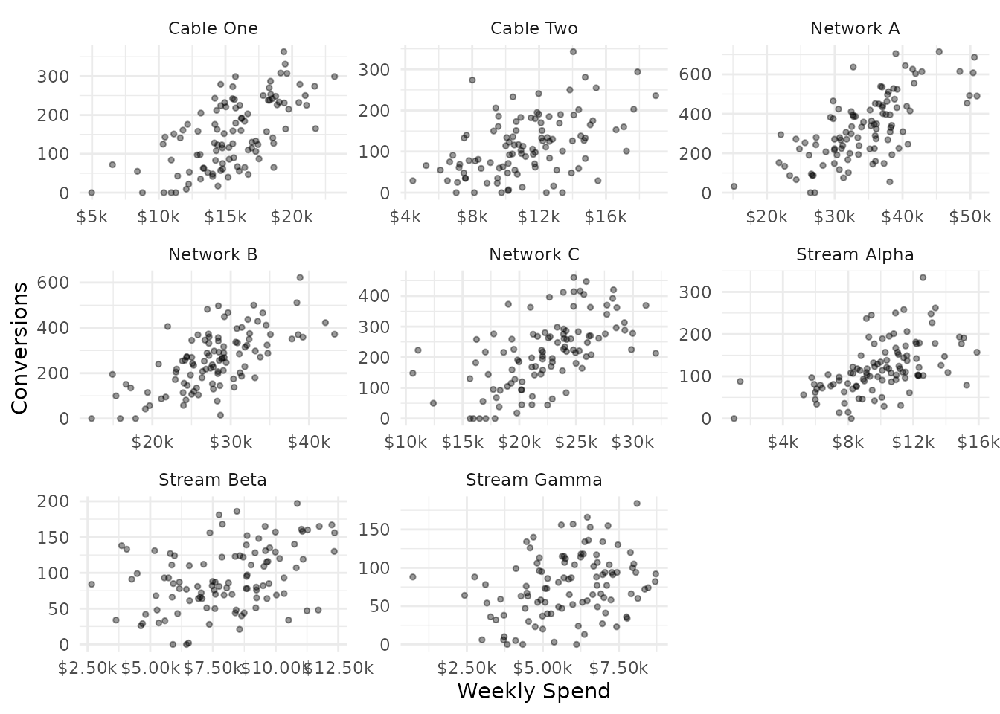
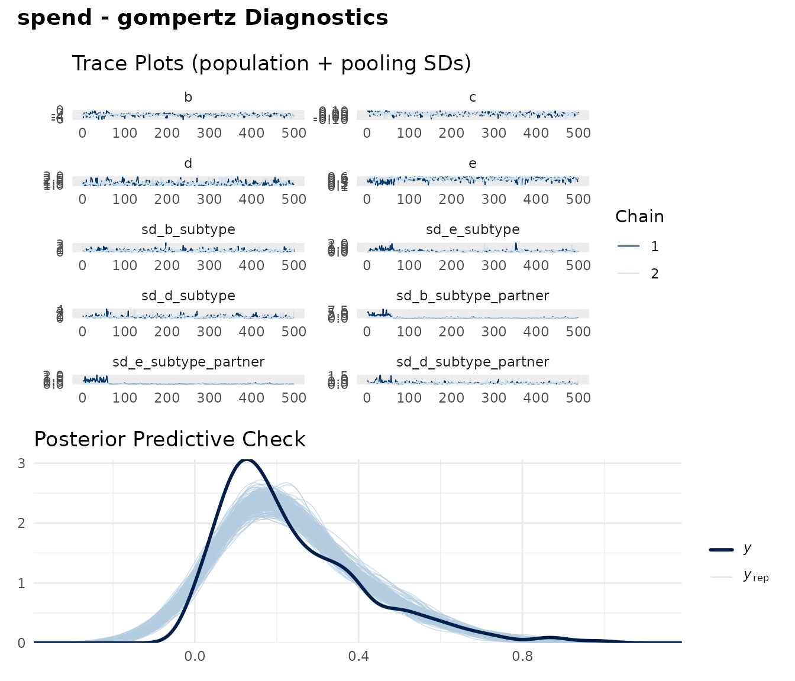
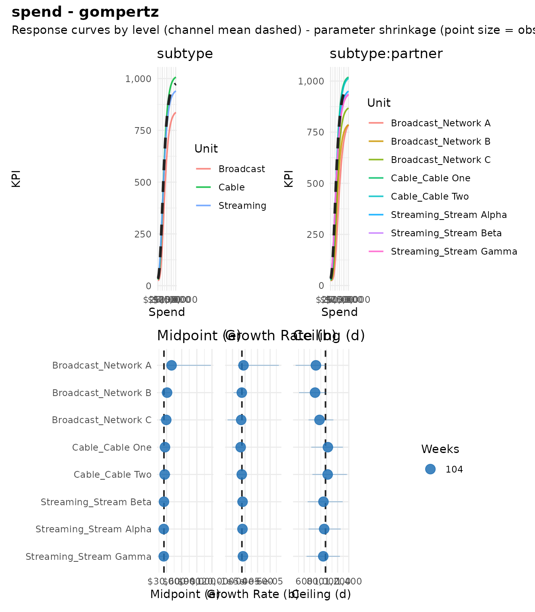
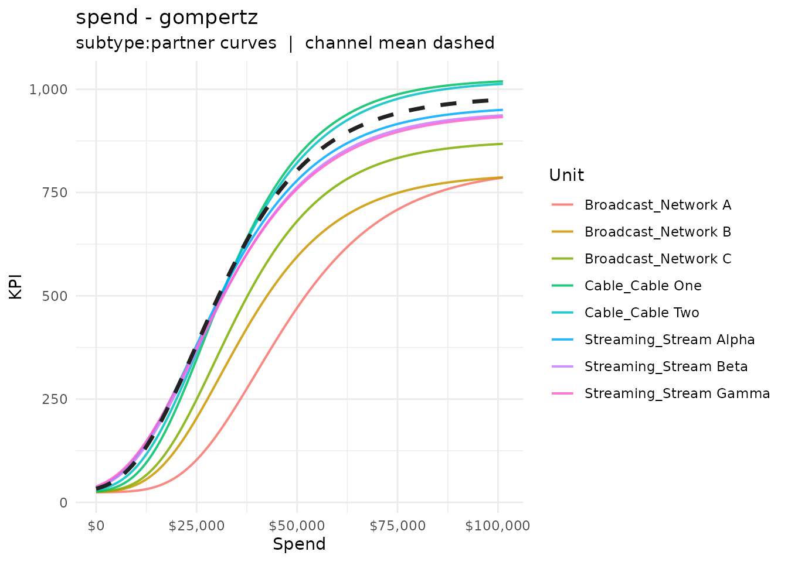
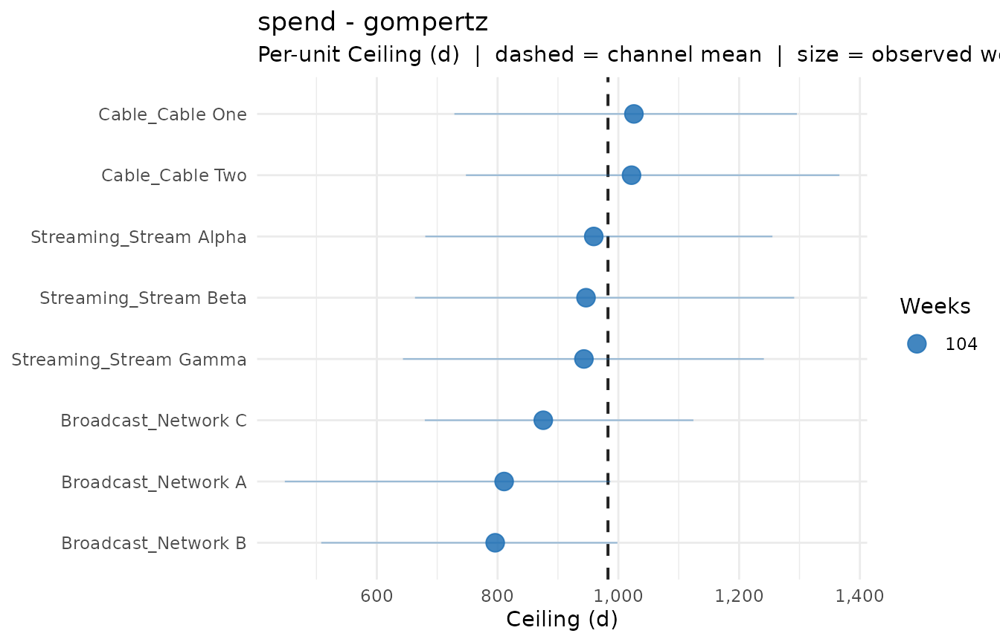
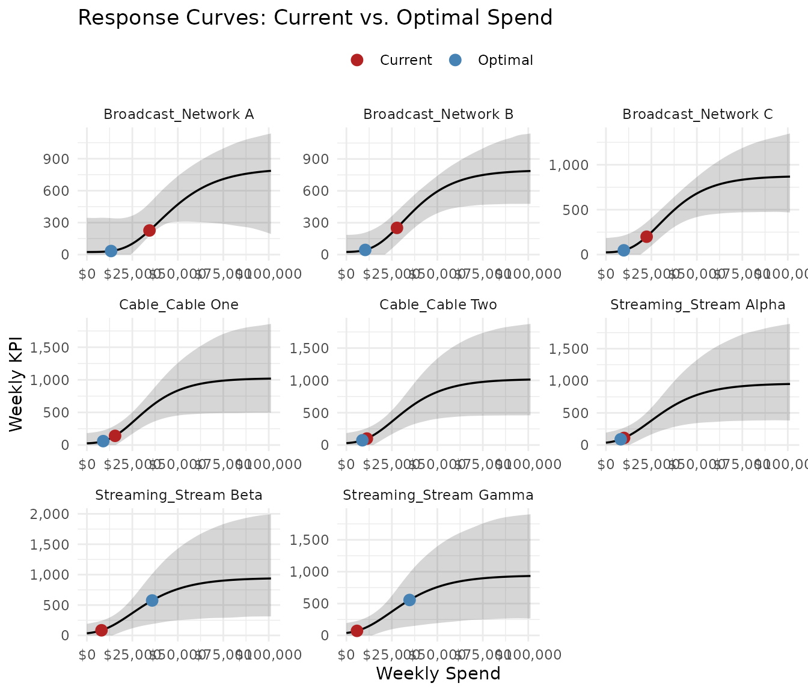

# Hierarchical Models

Media channels are rarely homogeneous. TV spend spans broadcast, cable,
and streaming — each with different audience reach and saturation
dynamics. Social covers multiple partners, tactics, and creatives.
Standard response curve modeling treats the channel as a single unit,
which either overfits sparse sub-channel data or discards useful
granularity.

[`fit_response_hier()`](https://bdshaff.github.io/mrmopt/reference/fit_response_hier.md)
fits a single hierarchical model where curve parameters are **partially
pooled** across sub-channel groupings. Sparse units borrow strength from
better-identified peers, while well-observed units retain their
individual character. This vignette walks through the full hierarchical
workflow using the built-in `mrmopt_hier_data` dataset.

------------------------------------------------------------------------

## The data

`mrmopt_hier_data` contains weekly spend and conversions for eight TV
partners nested within three subtypes:

``` r

data(mrmopt_hier_data)
mrmopt_hier_data
#> # A tibble: 832 × 5
#>    subtype   partner   week       spend conversions
#>    <fct>     <fct>     <date>     <dbl>       <int>
#>  1 Broadcast Network A 2023-01-02 28697         207
#>  2 Broadcast Network A 2023-01-09 40046         309
#>  3 Broadcast Network A 2023-01-16 48440         615
#>  4 Broadcast Network A 2023-01-23 30736         279
#>  5 Broadcast Network A 2023-01-30 29766         465
#>  6 Broadcast Network A 2023-02-06 29779         375
#>  7 Broadcast Network A 2023-02-13 21791         152
#>  8 Broadcast Network A 2023-02-20 23376          87
#>  9 Broadcast Network A 2023-02-27 30683         117
#> 10 Broadcast Network A 2023-03-06 50970         490
#> # ℹ 822 more rows
```

``` r

mrmopt_hier_data |>
  group_by(subtype, partner) |>
  summarise(
    weeks       = n(),
    avg_spend   = mean(spend),
    avg_conv    = mean(conversions),
    .groups     = "drop"
  )
#> # A tibble: 8 × 5
#>   subtype   partner      weeks avg_spend avg_conv
#>   <fct>     <fct>        <int>     <dbl>    <dbl>
#> 1 Broadcast Network A      104    34424.    327. 
#> 2 Broadcast Network B      104    27800.    257. 
#> 3 Broadcast Network C      104    22375.    214. 
#> 4 Cable     Cable One      104    15500.    152. 
#> 5 Cable     Cable Two      104    11246.    113. 
#> 6 Streaming Stream Alpha   104     9960.    120. 
#> 7 Streaming Stream Beta    104     8031.     92.6
#> 8 Streaming Stream Gamma   104     5807.     76.5
```

The hierarchy has two levels: `subtype` (Broadcast, Cable, Streaming)
and `partner` (the individual units within each subtype). Broadcast
partners have higher spend and ceiling than Streaming partners, but all
share a common curve family.

``` r

ggplot(mrmopt_hier_data, aes(x = spend, y = conversions)) +
  geom_point(alpha = 0.4, size = 1) +
  facet_wrap(~partner, scales = "free") +
  scale_x_continuous(labels = scales::dollar_format(scale = 1e-3, suffix = "k")) +
  labs(x = "Weekly Spend", y = "Conversions") +
  theme_minimal()
```



------------------------------------------------------------------------

## When to use hierarchical models

Use
[`fit_response_hier()`](https://bdshaff.github.io/mrmopt/reference/fit_response_hier.md)
when:

- A channel has **natural sub-groups** (partners, tactics, creatives,
  regions) that share a common response shape but differ in scale
- Some sub-groups have **sparse data** — too few weeks to identify a
  curve on their own, but enough to contribute information when pooled
- You want **per-unit response curves** for optimization or reporting,
  but don’t want to fit each unit independently and risk overfitting

Do not use hierarchical models when:

- Sub-groups have fundamentally different response dynamics (different
  curve *types*, not just different parameters). Fit them separately.
- You have only one grouping level with 2 groups — the pooling SD will
  be poorly identified.
- All sub-groups have ample data and you don’t need borrowing.
  Independent fits via
  [`fit_response()`](https://bdshaff.github.io/mrmopt/reference/fit_response.md)
  are simpler and faster.

------------------------------------------------------------------------

## Fit the hierarchical model

Specify the grouping columns in order from broadest to finest:

``` r

fit_tv <- fit_response_hier(
  data           = mrmopt_hier_data,
  spend          = "spend",
  kpi            = "conversions",
  date           = "week",
  group          = c("subtype", "partner"),
  type           = "gompertz",
  pool           = c("b", "e", "d"),
  midpoint_range = c(0.1, 0.6),
  ceiling_max    = 3,
  refresh        = 0,
  iter = 1000,
  chains = 2
)
#> conversions ~ c + (d - c) * exp(-exp(b * (spend - e))) 
#> b ~ 1 + (1 | subtype) + (1 | subtype:partner)
#> c ~ 1
#> d ~ 1 + (1 | subtype) + (1 | subtype:partner)
#> e ~ 1 + (1 | subtype) + (1 | subtype:partner)
```

The `group` argument defines the nesting structure. With
`group = c("subtype", "partner")`, the model fits:

- **Fixed effects**: The channel-level (population) mean curve
- **Random effects at level 1** (`subtype`): Deviations for Broadcast,
  Cable, Streaming
- **Random effects at level 2** (`subtype:partner`): Partner-level
  deviations nested within subtypes

The `pool` argument controls which parameters receive random effects.
The default `c("b", "e", "d")` pools steepness, midpoint, and ceiling.
The floor `c` is shared across all units — it represents baseline
conversions at zero spend, which is usually a channel-level property.

------------------------------------------------------------------------

## Diagnostics

Check convergence the same way as a single-channel model:

``` r

mrm_plot_hier_diagnostics(fit_tv)
```



Look for the same targets: clean trace plots, Rhat ≤ 1.01, ESS \> 400.
The hierarchical model has more parameters (population + group SDs +
per-unit deviations), so convergence can be slower. If you see issues,
try:

- Increasing `iter` and `warmup`
- Reducing the number of pooled parameters (e.g., `pool = c("b", "e")`)
- Increasing `adapt_delta` via `control = list(adapt_delta = 0.99)`

------------------------------------------------------------------------

## Summaries

[`print()`](https://rdrr.io/r/base/print.html) provides a concise
overview:

``` r

print(fit_tv)
#> -- Hierarchical Response Curve: gompertz ------------------------------------- 
#> Channel: spend  |  KPI: conversions
#> -- Hierarchy ----------------------------------------------------------------- 
#>   Level 1: subtype              3 unit(s)
#>   Level 2: partner              8 unit(s)
#>   Pooled parameters: b, e, d
#> -- Channel-Level Parameters (mean curve) ------------------------------------- 
#>   b (growth rate):     -6.25e-05
#>   c (floor):           24
#>   d (ceiling):         983
#>   e (midpoint):        $24,824
#> -- Sub-Channel Units (8) ----------------------------------------------------- 
#>   unit                 wkly spend          KPI  ceiling (d)
#>   Broadcast_Network       $34,424          227          811
#>   Broadcast_Network       $27,800          252          796
#>   Broadcast_Network       $22,375          199          876
#>   Cable_Cable One         $15,500          141        1,026
#>   Cable_Cable Two         $11,246          100        1,022
#>   Streaming_Stream A       $9,960          110          959
#>   Streaming_Stream B       $8,031           85          946
#>   Streaming_Stream G       $5,807           72          943
#> -- Bayes R2 ------------------------------------------------------------------ 
#>   R2: 0.6372 (95% CI: [0.5357, 0.6658])
#> 
#> Use summary(x) for brms diagnostics; mrm_summary_hier(x) for the full table.
```

[`mrm_summary_hier()`](https://bdshaff.github.io/mrmopt/reference/mrm_summary_hier.md)
produces a detailed summary with one row per unit at every hierarchy
level, plus a channel-level aggregate:

``` r

mrm_summary_hier(fit_tv)
#> # A tibble: 12 × 40
#>    id             level channel rc_type weekly_spend weekly_units kpi_at_current
#>    <chr>          <chr> <chr>   <chr>          <dbl>        <dbl>          <dbl>
#>  1 Broadcast      subt… Broadc… gomper…       28200.           NA          264. 
#>  2 Cable          subt… Cable   gomper…       13373.           NA          129. 
#>  3 Streaming      subt… Stream… gomper…        7933.           NA           86.5
#>  4 Broadcast_Net… subt… Broadc… gomper…       34424.           NA          227. 
#>  5 Broadcast_Net… subt… Broadc… gomper…       27800.           NA          252. 
#>  6 Broadcast_Net… subt… Broadc… gomper…       22375.           NA          199. 
#>  7 Cable_Cable O… subt… Cable_… gomper…       15500.           NA          141. 
#>  8 Cable_Cable T… subt… Cable_… gomper…       11246.           NA          100. 
#>  9 Streaming_Str… subt… Stream… gomper…        9960.           NA          110. 
#> 10 Streaming_Str… subt… Stream… gomper…        8031.           NA           84.7
#> 11 Streaming_Str… subt… Stream… gomper…        5807.           NA           71.9
#> 12 (channel)      chan… (chann… gomper…       16893.           NA          210. 
#> # ℹ 33 more variables: ar_at_current <dbl>, mr_at_current <dbl>,
#> #   cp_at_current <dbl>, rr_at_current <dbl>, b <dbl>, c <dbl>, d <dbl>,
#> #   e <dbl>, range_min_spend <dbl>, range_min_units <dbl>, range_min_kpi <dbl>,
#> #   range_min_cp <dbl>, range_min_ar <dbl>, range_min_mr <dbl>,
#> #   range_min_rr <dbl>, range_peak_spend <dbl>, range_peak_units <dbl>,
#> #   range_peak_kpi <dbl>, range_peak_cp <dbl>, range_peak_ar <dbl>,
#> #   range_peak_mr <dbl>, range_peak_rr <dbl>, range_max_spend <dbl>, …
```

Each row shows the fitted curve parameters, current performance, and the
efficient operating range (range_min to range_max) for that unit.

------------------------------------------------------------------------

## Visualization

### Response curves by level

The dashboard view shows response curves at each hierarchy level:

``` r

mrm_plot_hier(fit_tv)
```



For response curves at a specific level:

``` r

mrm_plot_hier_response(fit_tv)
```



### Shrinkage

The shrinkage plot shows how each unit’s parameter estimate is pulled
toward the group mean by partial pooling. Units with more data are
pulled less; units with sparse data are pulled more:

``` r

mrm_plot_hier_shrinkage(fit_tv, param = "d")
```



This is the core benefit of hierarchical modeling — sparse partners get
regularized estimates rather than noisy independent fits.

------------------------------------------------------------------------

## Per-unit optimization

To optimize across sub-channel units, convert the hierarchical fit to a
list of single-curve model views using
[`as_mrmfit_list()`](https://bdshaff.github.io/mrmopt/reference/as_mrmfit_list.md):

``` r

unit_fits <- as_mrmfit_list(fit_tv)
names(unit_fits)
#> [1] "Broadcast_Network A"    "Broadcast_Network B"    "Broadcast_Network C"   
#> [4] "Cable_Cable One"        "Cable_Cable Two"        "Streaming_Stream Alpha"
#> [7] "Streaming_Stream Beta"  "Streaming_Stream Gamma"
```

Each element is an `mrmfit_hier_unit` object that behaves like a regular
`mrmfit` for optimization purposes. Pass the list to
[`opt_mix()`](https://bdshaff.github.io/mrmopt/reference/opt_mix.md):

``` r

opt_units <- opt_mix(unit_fits, budget = 130000)
#> 
#> Optimization setup:
#>   Channels:       8 
#>   Method:         point 
#>   Objective:      max_kpi 
#>   Weekly budget:  130,000 
#> 
#> Optimization converged (status: 4 )
#> Total weekly KPI: 1,480
opt_summary(opt_units)
#> -- Optimization Result (point) ----------------------------------------------- 
#> Budget: $130,000/week  |  Channels: 8
#> -- Optimal Allocation -------------------------------------------------------- 
#>   Channel                     Weekly Spend    Weekly KPI          CP    Share 
#>   Streaming_Stream Beta            $35,887           575         $62   27.6%
#>   Streaming_Stream Gamma           $34,740           556         $62   26.7%
#>   Streaming_Stream Alpha            $8,139            90         $91    6.3%
#>   Cable_Cable Two                   $8,781            73        $119    6.8%
#>   Cable_Cable One                   $8,984            60        $150    6.9%
#>   Broadcast_Network C               $9,828            48        $205    7.6%
#>   Broadcast_Network B              $10,335            44        $234    7.9%
#>   Broadcast_Network A              $13,307            34        $395   10.2%
#> -- Totals -------------------------------------------------------------------- 
#>   Optimal:  Spend $130,000  |  KPI 1,480  |  Avg CP $88
#>   Current:  Spend $135,144  |  KPI 1,186  |  Avg CP $114
#>   Change:   KPI +24.8%  |  CP $26
```

The optimizer now allocates spend across all eight partners
simultaneously, respecting each unit’s response curve:

``` r

opt_plot_curves(opt_units)
```



### Optimizing at a higher level

By default,
[`as_mrmfit_list()`](https://bdshaff.github.io/mrmopt/reference/as_mrmfit_list.md)
extracts at the innermost (finest) level. To optimize at the subtype
level instead:

``` r

subtype_fits <- as_mrmfit_list(fit_tv, level = "subtype")
names(subtype_fits)
#> [1] "Broadcast" "Cable"     "Streaming"
```

``` r

opt_subtypes <- opt_mix(subtype_fits, budget = 130000)
#> 
#> Optimization setup:
#>   Channels:       3 
#>   Method:         point 
#>   Objective:      max_kpi 
#>   Weekly budget:  130,000 
#> 
#> Optimization converged (status: 4 )
#> Total weekly KPI: 1,966
opt_summary(opt_subtypes)
#> -- Optimization Result (point) ----------------------------------------------- 
#> Budget: $130,000/week  |  Channels: 3
#> -- Optimal Allocation -------------------------------------------------------- 
#>   Channel        Weekly Spend    Weekly KPI          CP    Share 
#>   Cable               $44,331           750         $59   34.1%
#>   Streaming           $40,645           656         $62   31.3%
#>   Broadcast           $45,023           560         $80   34.6%
#> -- Totals -------------------------------------------------------------------- 
#>   Optimal:  Spend $130,000  |  KPI 1,966  |  Avg CP $66
#>   Current:  Spend $49,506  |  KPI 480  |  Avg CP $103
#>   Change:   KPI +309.5%  |  CP $37
```

This is useful when you control budget at the subtype level but want the
subtype-level curves to reflect partial pooling from the partner data
below.

------------------------------------------------------------------------

## The `pool` parameter

The choice of which parameters to pool affects how much information is
shared:

| Setting | Effect |
|----|----|
| `pool = c("b", "e", "d")` | Default. Shape and scale vary by unit. Most flexible. |
| `pool = c("b", "e")` | Shape varies; ceiling `d` is fixed at channel level. Use when units have similar market size. |
| `pool = c("d")` | Only scale varies; shape is shared. Use when units have similar saturation dynamics but different sizes. |
| `pool = c("b", "c", "d", "e")` | All four parameters pooled. Maximum borrowing. |

Adding more pooled parameters increases model complexity and can slow
convergence. Start with the default and remove parameters from `pool` if
convergence is poor or if domain knowledge says certain parameters
should be shared.

------------------------------------------------------------------------

## Where to go next

| Topic | Vignette |
|----|----|
| Budget optimization objectives and constraints | [Optimization](https://bdshaff.github.io/mrmopt/articles/optimization.md) |
| Prior tuning when hierarchical fits struggle | [Priors & Model Tuning](https://bdshaff.github.io/mrmopt/articles/priors_and_tuning.md) |
| Mathematical foundations of the six curve forms | [Response Curve Theory](https://bdshaff.github.io/mrmopt/articles/response_curve_theory.md) |
