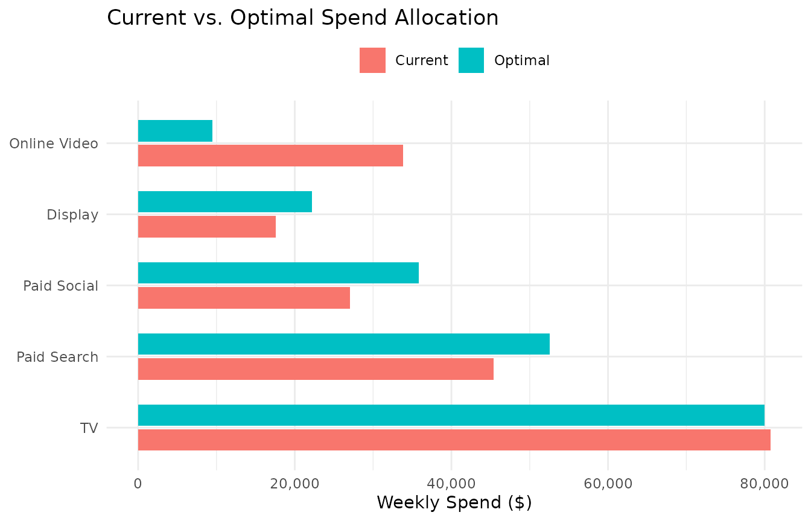
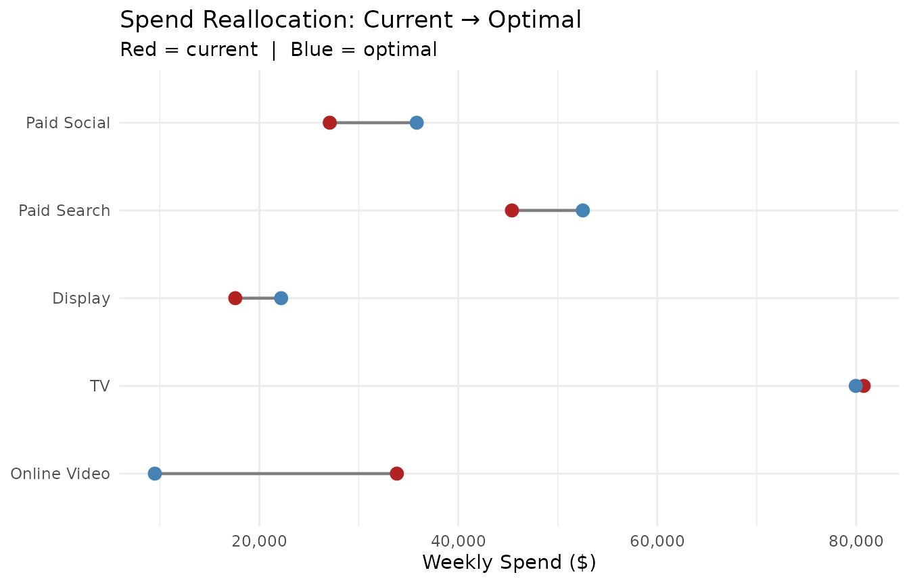
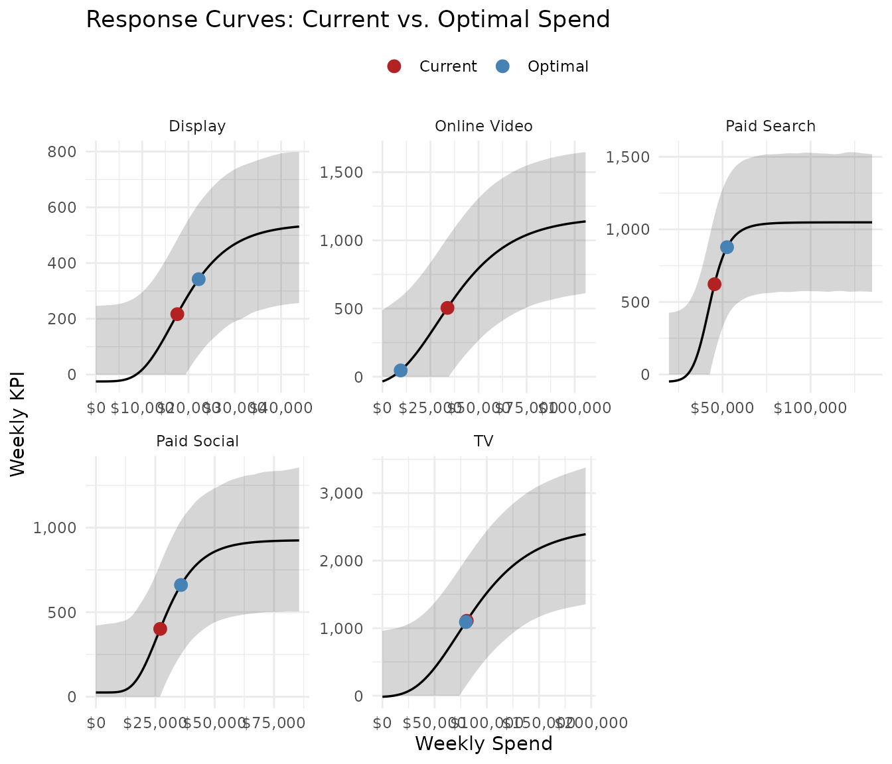
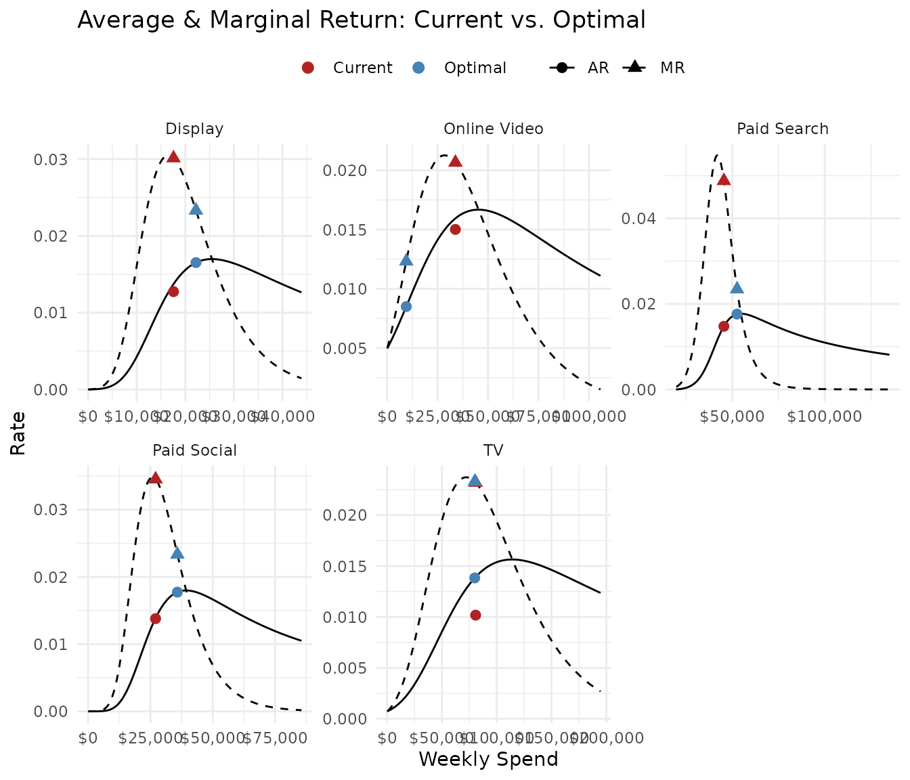
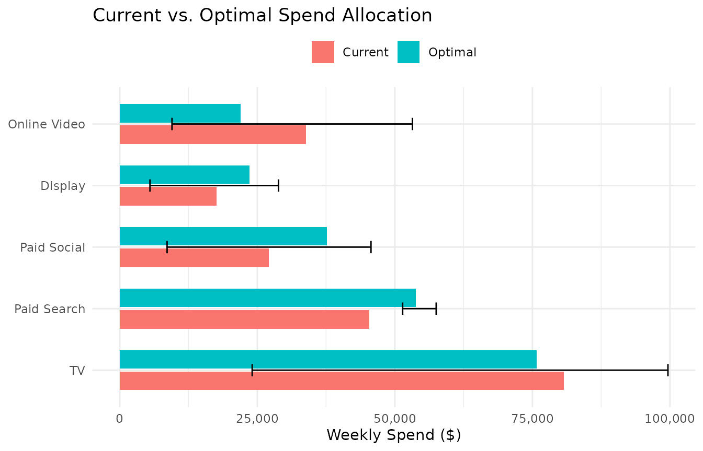
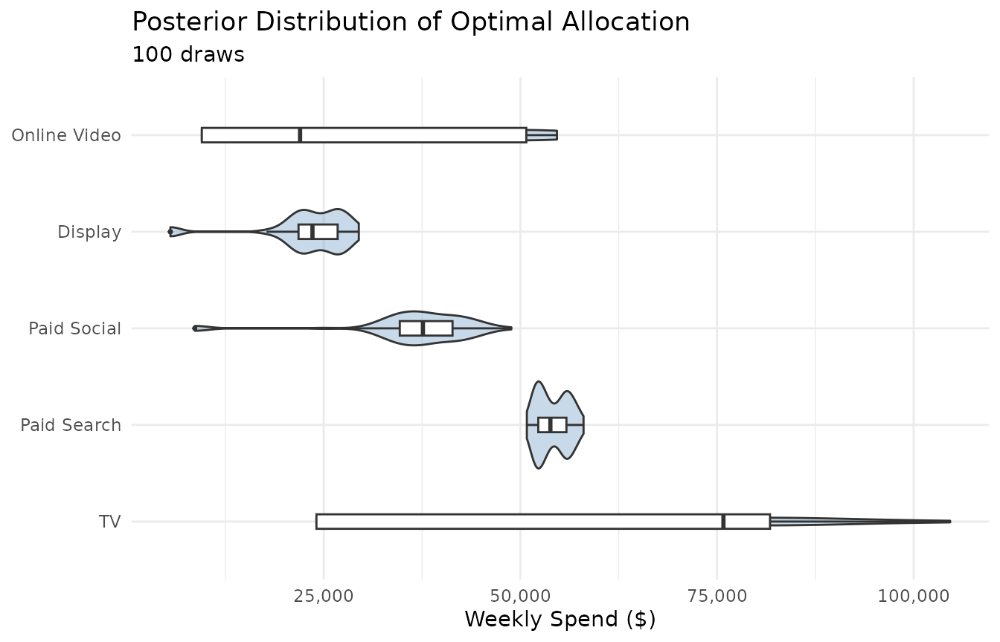

# Optimization

[`opt_mix()`](https://bdshaff.github.io/mrmopt/reference/opt_mix.md)
takes a portfolio of fitted response curves and finds the spend
allocation that achieves a specified objective — maximizing KPI, hitting
a ROI target, or reaching a marginal efficiency threshold. This vignette
covers all five objectives, the constraint system, point vs. posterior
methods, and how to interpret and visualize results.

------------------------------------------------------------------------

## Setup: fit the portfolio

We’ll use all five channels from `mrmopt_data`. In practice, you should
have already run diagnostics on each fit (see [Diagnostics & Model
Comparison](https://bdshaff.github.io/mrmopt/articles/diagnostics_and_comparison.md)).

``` r

channel_types <- list(
  "Paid Search"  = "log_logistic",
  "Paid Social"  = "gompertz",
  "Display"      = "gompertz",
  "Online Video" = "gompertz",
  "TV"           = "gompertz"
)

fits <- lapply(names(channel_types), function(ch) {
  fit_response(
    data  = mrmopt_data |> filter(channel == ch),
    spend = "spend",
    kpi   = "conversions",
    date  = "week",
    type  = channel_types[[ch]],
    midpoint_range = c(0.1, 0.5),
    ceiling_max    = 3,
    refresh        = 0,
    iter = 1000,
    chains = 2
  )
})
#> conversions ~ c + ((d - c)/(1 + exp(b * (log(spend) - log(e))))) 
#> b ~ 1
#> c ~ 1
#> d ~ 1
#> e ~ 1
#> conversions ~ c + (d - c) * exp(-exp(b * (spend - e))) 
#> b ~ 1
#> c ~ 1
#> d ~ 1
#> e ~ 1
#> conversions ~ c + (d - c) * exp(-exp(b * (spend - e))) 
#> b ~ 1
#> c ~ 1
#> d ~ 1
#> e ~ 1
#> conversions ~ c + (d - c) * exp(-exp(b * (spend - e))) 
#> b ~ 1
#> c ~ 1
#> d ~ 1
#> e ~ 1
#> conversions ~ c + (d - c) * exp(-exp(b * (spend - e))) 
#> b ~ 1
#> c ~ 1
#> d ~ 1
#> e ~ 1
names(fits) <- names(channel_types)
```

The current total weekly spend across all channels:

``` r

current_budget <- sum(sapply(fits, function(f) {
  mean(f$data[[f$spend_col]])
}))
cat("Current weekly budget: $", scales::comma(round(current_budget)), "\n")
#> Current weekly budget: $ 3
```

------------------------------------------------------------------------

## Objective 1: Maximize KPI (fixed budget)

The default objective. Given a total budget, find the allocation that
maximizes total predicted KPI:

``` r

opt <- opt_mix(fits, budget = 200000)
#> 
#> Optimization setup:
#>   Channels:       5 
#>   Method:         point 
#>   Objective:      max_kpi 
#>   Weekly budget:  2e+05 
#> 
#> Optimization converged (status: 4 )
#> Total weekly KPI: 3,017
```

[`opt_summary()`](https://bdshaff.github.io/mrmopt/reference/opt_summary.md)
prints a formatted allocation table:

``` r

opt_summary(opt)
#> -- Optimization Result (point) ----------------------------------------------- 
#> Budget: $200,000/week  |  Channels: 5
#> -- Optimal Allocation -------------------------------------------------------- 
#>   Channel           Weekly Spend    Weekly KPI          CP    Share 
#>   Paid Social            $35,825           661         $54   17.9%
#>   Paid Search            $52,525           877         $60   26.3%
#>   Display                $22,195           342         $65   11.1%
#>   TV                     $79,957         1,090         $73   40.0%
#>   Online Video            $9,498            46        $206    4.7%
#> -- Totals -------------------------------------------------------------------- 
#>   Optimal:  Spend $200,000  |  KPI 3,017  |  Avg CP $66
#>   Current:  Spend $204,641  |  KPI 2,854  |  Avg CP $72
#>   Change:   KPI +5.7%  |  CP $5
```

[`opt_table()`](https://bdshaff.github.io/mrmopt/reference/opt_table.md)
returns the same information as a tidy tibble, useful for downstream
analysis or reporting:

``` r

opt_table(opt) |>
  select(channel, current_spend, optimal_spend, spend_delta_pct,
         current_kpi, optimal_kpi, kpi_delta_pct)
#> # A tibble: 6 × 7
#>   channel    current_spend optimal_spend spend_delta_pct current_kpi optimal_kpi
#>   <chr>              <dbl>         <dbl>           <dbl>       <dbl>       <dbl>
#> 1 Paid Soci…        27082         35825.         0.323          401.       661. 
#> 2 Paid Sear…        45395.        52525.         0.157          622.       877. 
#> 3 Display           17581.        22195.         0.262          217.       342. 
#> 4 TV                80753.        79957.        -0.00985       1109.      1090. 
#> 5 Online Vi…        33829.         9498.        -0.719          505.        46.1
#> 6 TOTAL            204641.       200000         -0.0227        2854.      3017. 
#> # ℹ 1 more variable: kpi_delta_pct <dbl>
```

### Visualizing the result

``` r

opt_plot_allocation(opt)
```



The dumbbell chart shows the magnitude and direction of each
reallocation:

``` r

opt_plot_comparison(opt)
```



To see where each channel’s optimal spend falls on its response curve:

``` r

opt_plot_curves(opt)
```



And on the marginal/average return curves — the view that explains *why*
the optimizer moved spend the way it did:

``` r

opt_plot_returns(opt)
```



At the optimum, marginal returns are equalized across channels (within
constraint bounds). Channels where the optimal point has higher MR than
others are constrained — the optimizer would like to allocate more but
is hitting a bound.

------------------------------------------------------------------------

## Objective 2: Target ROI (flexible budget)

Instead of fixing the budget and maximizing KPI, target a minimum
portfolio ROI and let the optimizer find the budget:

``` r

opt_roi <- opt_mix(fits, objective = "target_roi", target_roi = 2.0)
#> 
#> Optimization setup:
#>   Channels:       5 
#>   Method:         point 
#>   Objective:      target_roi >= 2 
#> 
#> Optimization converged (status: 4 )
#> Discovered weekly budget: 80,200 
#> Achieved ROI: 0.005 
#> Total weekly KPI: 304
opt_summary(opt_roi)
#> -- Optimization Result (point, target ROI ≥ 2) ------------------------------- 
#> Optimal budget: $80,200/week  |  Channels: 5
#> -- Optimal Allocation -------------------------------------------------------- 
#>   Channel           Weekly Spend    Weekly KPI          CP    Share 
#>   Paid Search            $13,972           -49       $-283   17.4%
#>   Paid Social            $20,777           191        $109   25.9%
#>   Online Video            $9,498            46        $206   11.8%
#>   Display                $11,884            55        $217   14.8%
#>   TV                     $24,070            62        $390   30.0%
#> -- Totals -------------------------------------------------------------------- 
#>   Optimal:  Spend $80,200  |  KPI 304  |  Avg CP $264
#>   Current:  Spend $204,641  |  KPI 2,854  |  Avg CP $72
#>   Change:   KPI -89.3%  |  CP +$192
#>   Budget Δ: $124,440 (-60.8%)
#>   Achieved ROI: 0.005
```

The budget is now an *output*, not an input:

``` r

cat("Weekly budget at target ROI:", scales::dollar(opt_roi$budget_info$weekly_budget), "\n")
#> Weekly budget at target ROI: $80,200.35
cat("Achieved ROI:", round(opt_roi$achieved_roi, 2), "\n")
#> Achieved ROI: 0.01
```

ROI here is defined as total incremental KPI divided by total spend:

``` math
\text{ROI} = \frac{\sum_i [f_i(x_i) - f_i(0)]}{\sum_i x_i}
```

where
``` math
f_i(0)
```
is the floor (baseline KPI at zero spend) for each channel.

------------------------------------------------------------------------

## Objective 3: Target marginal ROI (per-channel)

Target mROI sets each channel’s spend to where its marginal return
equals a threshold. This is a per-channel operation — no cross-channel
optimization is needed:

``` r

opt_mroi <- opt_mix(fits, objective = "target_mroi", target_mroi = 0.01)
#> 
#> Optimization setup:
#>   Channels:       5 
#>   Method:         point 
#>   Objective:      target_mroi = 0.01 
#> 
#> Per-channel mROI root-finding complete.
#> Discovered weekly budget: 333,604 
#> Total weekly KPI: 5,268 
#> Per-channel achieved mROI:
#>   Paid Search: 0.01
#>   Paid Social: 0.01
#>   Display: 0.01
#>   Online Video: 0.01
#>   TV: 0.01
opt_summary(opt_mroi)
#> -- Optimization Result (point, target mROI = 0.01) --------------------------- 
#> Optimal budget: $333,604/week  |  Channels: 5
#> -- Optimal Allocation -------------------------------------------------------- 
#>   Channel           Weekly Spend    Weekly KPI          CP    Share 
#>   Paid Social            $46,046           825         $56   13.8%
#>   Paid Search            $58,651           974         $60   17.6%
#>   Display                $29,972           468         $64    9.0%
#>   Online Video           $61,313           933         $66   18.4%
#>   TV                    $137,622         2,068         $67   41.3%
#> -- Totals -------------------------------------------------------------------- 
#>   Optimal:  Spend $333,604  |  KPI 5,268  |  Avg CP $63
#>   Current:  Spend $204,641  |  KPI 2,854  |  Avg CP $72
#>   Change:   KPI +84.6%  |  CP $8
#>   Budget Δ: +$128,963 (+63%)
#>   Per-channel mROI at solution:
#>     Paid Search: 0.01
#>     Paid Social: 0.01
#>     Display: 0.01
#>     Online Video: 0.01
#>     TV: 0.01
```

The resulting budget is the sum of per-channel solutions:

``` r

cat("Weekly budget at target mROI:", scales::dollar(opt_mroi$budget_info$weekly_budget), "\n")
#> Weekly budget at target mROI: $333,604
```

Target mROI is useful for setting a “minimum efficiency” threshold: stop
investing in a channel when the next dollar generates less than
`target_mroi` units of KPI.

------------------------------------------------------------------------

## Objectives 4 & 5: Cost-per-KPI framing

For non-revenue KPIs (leads, visits, sign-ups), thinking in ROI
(KPI/spend) is less natural than cost-per (spend/KPI). The `target_cpk`
and `target_mcpk` objectives are convenience wrappers:

``` r

# "Stop spending when each conversion costs more than $100 on average"
opt_cpk <- opt_mix(fits, objective = "target_cpk", target_cpk = 100)
#> 
#> Optimization setup:
#>   Channels:       5 
#>   Method:         point 
#>   Objective:      target_cpk <= $100 
#> 
#> Optimization converged (status: 4 )
#> Discovered weekly budget: 625,062 
#> Achieved ROI: 0.01 
#> Total weekly KPI: 6,152
opt_summary(opt_cpk)
#> -- Optimization Result (point, target CPK ≤ $100) ---------------------------- 
#> Optimal budget: $625,062/week  |  Channels: 5
#> -- Optimal Allocation -------------------------------------------------------- 
#>   Channel           Weekly Spend    Weekly KPI          CP    Share 
#>   Paid Search            $84,209         1,045         $81   13.5%
#>   Paid Social            $78,427           922         $85   12.5%
#>   Display                $53,335           538         $99    8.5%
#>   TV                    $273,140         2,483        $110   43.7%
#>   Online Video          $135,950         1,163        $117   21.7%
#> -- Totals -------------------------------------------------------------------- 
#>   Optimal:  Spend $625,062  |  KPI 6,152  |  Avg CP $102
#>   Current:  Spend $204,641  |  KPI 2,854  |  Avg CP $72
#>   Change:   KPI +115.6%  |  CP +$30
#>   Budget Δ: +$420,421 (+205.4%)
#>   Achieved CPK: $100
```

``` r

# "Stop spending when the next conversion costs more than $150"
opt_mcpk <- opt_mix(fits, objective = "target_mcpk", target_mcpk = 150)
#> 
#> Optimization setup:
#>   Channels:       5 
#>   Method:         point 
#>   Objective:      target_mcpk <= $150 
#> 
#> Per-channel mROI root-finding complete.
#> Discovered weekly budget: 372,869 
#> Total weekly KPI: 5,592 
#> Per-channel achieved mROI:
#>   Paid Search: 0.006667
#>   Paid Social: 0.006667
#>   Display: 0.006667
#>   Online Video: 0.006667
#>   TV: 0.006667
opt_summary(opt_mcpk)
#> -- Optimization Result (point, target mCPK ≤ $150) --------------------------- 
#> Optimal budget: $372,869/week  |  Channels: 5
#> -- Optimal Allocation -------------------------------------------------------- 
#>   Channel           Weekly Spend    Weekly KPI          CP    Share 
#>   Paid Social            $50,312           860         $59   13.5%
#>   Paid Search            $61,514           998         $62   16.5%
#>   Display                $33,086           493         $67    8.9%
#>   TV                    $156,223         2,222         $70   41.9%
#>   Online Video           $71,735         1,019         $70   19.2%
#> -- Totals -------------------------------------------------------------------- 
#>   Optimal:  Spend $372,869  |  KPI 5,592  |  Avg CP $67
#>   Current:  Spend $204,641  |  KPI 2,854  |  Avg CP $72
#>   Change:   KPI +96%  |  CP $5
#>   Budget Δ: +$168,229 (+82.2%)
#>   Per-channel marginal CPK at solution:
#>     Paid Search: $150
#>     Paid Social: $150
#>     Display: $150
#>     Online Video: $150
#>     TV: $150
```

Internally, `target_cpk` converts to `target_roi = 1 / target_cpk` and
`target_mcpk` converts to `target_mroi = 1 / target_mcpk`.

------------------------------------------------------------------------

## Point vs. posterior optimization

All objectives support two methods:

### Point estimate (default)

Uses the posterior median parameters for each channel. Fast (\< 1
second) and produces a single optimal allocation. Good for quick
scenario analysis:

``` r

opt_point <- opt_mix(fits, budget = 200000, method = "point")
#> 
#> Optimization setup:
#>   Channels:       5 
#>   Method:         point 
#>   Objective:      max_kpi 
#>   Weekly budget:  2e+05 
#> 
#> Optimization converged (status: 4 )
#> Total weekly KPI: 3,017
```

### Posterior

Runs the optimizer over `n_draws` posterior draws, producing a
*distribution* of optimal allocations that reflects parameter
uncertainty:

``` r

opt_post <- opt_mix(fits, budget = 200000, method = "posterior", n_draws = 100)
#> 
#> Optimization setup:
#>   Channels:       5 
#>   Method:         posterior 
#>   Objective:      max_kpi 
#>   Weekly budget:  2e+05 
#> 
#> Optimizing across 100 posterior draws...
#>   |                                                                              |                                                                      |   0%  |                                                                              |=                                                                     |   1%  |                                                                              |=                                                                     |   2%  |                                                                              |==                                                                    |   3%  |                                                                              |===                                                                   |   4%  |                                                                              |====                                                                  |   5%  |                                                                              |====                                                                  |   6%  |                                                                              |=====                                                                 |   7%  |                                                                              |======                                                                |   8%  |                                                                              |======                                                                |   9%  |                                                                              |=======                                                               |  10%  |                                                                              |========                                                              |  11%  |                                                                              |========                                                              |  12%  |                                                                              |=========                                                             |  13%  |                                                                              |==========                                                            |  14%  |                                                                              |==========                                                            |  15%  |                                                                              |===========                                                           |  16%  |                                                                              |============                                                          |  17%  |                                                                              |=============                                                         |  18%  |                                                                              |=============                                                         |  19%  |                                                                              |==============                                                        |  20%  |                                                                              |===============                                                       |  21%  |                                                                              |===============                                                       |  22%  |                                                                              |================                                                      |  23%  |                                                                              |=================                                                     |  24%  |                                                                              |==================                                                    |  25%  |                                                                              |==================                                                    |  26%  |                                                                              |===================                                                   |  27%  |                                                                              |====================                                                  |  28%  |                                                                              |====================                                                  |  29%  |                                                                              |=====================                                                 |  30%  |                                                                              |======================                                                |  31%  |                                                                              |======================                                                |  32%  |                                                                              |=======================                                               |  33%  |                                                                              |========================                                              |  34%  |                                                                              |========================                                              |  35%  |                                                                              |=========================                                             |  36%  |                                                                              |==========================                                            |  37%  |                                                                              |===========================                                           |  38%  |                                                                              |===========================                                           |  39%  |                                                                              |============================                                          |  40%  |                                                                              |=============================                                         |  41%  |                                                                              |=============================                                         |  42%  |                                                                              |==============================                                        |  43%  |                                                                              |===============================                                       |  44%  |                                                                              |================================                                      |  45%  |                                                                              |================================                                      |  46%  |                                                                              |=================================                                     |  47%  |                                                                              |==================================                                    |  48%  |                                                                              |==================================                                    |  49%  |                                                                              |===================================                                   |  50%  |                                                                              |====================================                                  |  51%  |                                                                              |====================================                                  |  52%  |                                                                              |=====================================                                 |  53%  |                                                                              |======================================                                |  54%  |                                                                              |======================================                                |  55%  |                                                                              |=======================================                               |  56%  |                                                                              |========================================                              |  57%  |                                                                              |=========================================                             |  58%  |                                                                              |=========================================                             |  59%  |                                                                              |==========================================                            |  60%  |                                                                              |===========================================                           |  61%  |                                                                              |===========================================                           |  62%  |                                                                              |============================================                          |  63%  |                                                                              |=============================================                         |  64%  |                                                                              |==============================================                        |  65%  |                                                                              |==============================================                        |  66%  |                                                                              |===============================================                       |  67%  |                                                                              |================================================                      |  68%  |                                                                              |================================================                      |  69%  |                                                                              |=================================================                     |  70%  |                                                                              |==================================================                    |  71%  |                                                                              |==================================================                    |  72%  |                                                                              |===================================================                   |  73%  |                                                                              |====================================================                  |  74%  |                                                                              |====================================================                  |  75%  |                                                                              |=====================================================                 |  76%  |                                                                              |======================================================                |  77%  |                                                                              |=======================================================               |  78%  |                                                                              |=======================================================               |  79%  |                                                                              |========================================================              |  80%  |                                                                              |=========================================================             |  81%  |                                                                              |=========================================================             |  82%  |                                                                              |==========================================================            |  83%  |                                                                              |===========================================================           |  84%  |                                                                              |============================================================          |  85%  |                                                                              |============================================================          |  86%  |                                                                              |=============================================================         |  87%  |                                                                              |==============================================================        |  88%  |                                                                              |==============================================================        |  89%  |                                                                              |===============================================================       |  90%  |                                                                              |================================================================      |  91%  |                                                                              |================================================================      |  92%  |                                                                              |=================================================================     |  93%  |                                                                              |==================================================================    |  94%  |                                                                              |==================================================================    |  95%  |                                                                              |===================================================================   |  96%  |                                                                              |====================================================================  |  97%  |                                                                              |===================================================================== |  98%  |                                                                              |===================================================================== |  99%  |                                                                              |======================================================================| 100%
#> 
#> Posterior optimization complete.
#> Median total weekly KPI: 3,305
opt_summary(opt_post)
#> -- Optimization Result (posterior, 100 draws) -------------------------------- 
#> Budget: $200,000/week  |  Channels: 5
#> -- Optimal Allocation -------------------------------------------------------- 
#>   Channel           Weekly Spend                  [95% CI]          CP    Share 
#>   Paid Social            $37,606      [$8,603 – $45,659]         $55  +17.7%
#>   Paid Search            $53,812     [$51,411 – $57,515]         $59  +25.3%
#>   Online Video           $21,988      [$9,498 – $53,197]         $61  +10.3%
#>   Display                $23,564      [$5,495 – $28,847]         $61  +11.1%
#>   TV                     $75,815     [$24,070 – $99,635]         $78  +35.6%
#> -- Totals -------------------------------------------------------------------- 
#>   Optimal:  Spend $212,785  |  KPI 3,305  |  Avg CP $64
#>   Current:  Spend $204,641  |  KPI 2,854  |  Avg CP $72
#>   Change:   KPI +15.8%  |  CP $7
```

The `[95% CI]` column shows the range of optimal spend across draws.
Posterior allocation plots include error bars:

``` r

opt_plot_allocation(opt_post)
```



[`opt_plot_posterior()`](https://bdshaff.github.io/mrmopt/reference/opt_plot_posterior.md)
shows the full spend distribution per channel:

``` r

opt_plot_posterior(opt_post)
```



**When to use posterior**: When the allocation decision matters and you
want to understand how sensitive it is to parameter uncertainty. Wide
distributions signal channels where the data doesn’t strongly constrain
the optimal spend.

**When point is sufficient**: Scenario analysis, quick comparisons, or
when all channels have tight credible bands.

------------------------------------------------------------------------

## Period budgets

By default,
[`opt_mix()`](https://bdshaff.github.io/mrmopt/reference/opt_mix.md)
optimizes a single-week budget. To optimize an annual or quarterly
budget broken into weekly allocations, use `n_weeks`:

``` r

opt_annual <- opt_mix(fits, budget = 10000000, n_weeks = 52)
#> 
#> Optimization setup:
#>   Channels:       5 
#>   Method:         point 
#>   Objective:      max_kpi 
#>   Weekly budget:  192,308 
#>   Period budget:  1e+07  ( 52  weeks)
#> 
#> Optimization converged (status: 4 )
#> Total weekly KPI: 2,836 
#> Total period KPI: 147,452
opt_summary(opt_annual)
#> -- Optimization Result (point) ----------------------------------------------- 
#> Budget: $192,308/week  |  $10,000,000 over 52 weeks  |  Channels: 5
#> -- Optimal Allocation -------------------------------------------------------- 
#>   Channel           Weekly Spend    Weekly KPI          CP    Share 
#>   Paid Social            $35,552           654         $54   18.5%
#>   Paid Search            $52,382           874         $60   27.2%
#>   Display                $21,969           337         $65   11.4%
#>   TV                     $72,908           924         $79   37.9%
#>   Online Video            $9,498            46        $206    4.9%
#> -- Totals -------------------------------------------------------------------- 
#>   Optimal:  Spend $192,308  |  KPI 2,836  |  Avg CP $68
#>   Current:  Spend $204,641  |  KPI 2,854  |  Avg CP $72
#>   Change:   KPI -0.6%  |  CP $4
#> 
#>   Period (52 weeks): $10,000,000 spend  |  147,452 KPI
```

The optimizer finds the optimal *weekly* allocation, then scales to the
period. The `$solution` tibble contains both weekly and period columns.

------------------------------------------------------------------------

## Constraints

### Auto-generated (default)

When no `constraints` argument is provided,
[`opt_mix()`](https://bdshaff.github.io/mrmopt/reference/opt_mix.md)
generates bounds automatically from each channel’s fitted return rate
ranges, scaled by `bounds_multiplier` (default 3). This prevents the
optimizer from extrapolating far beyond observed spend levels.

### User-supplied constraints

Pass a data frame with channel-level bounds:

``` r

my_constraints <- data.frame(
  channel   = names(fits),
  min_spend = c(10000, 5000, 2000, 5000, 50000),
  max_spend = c(100000, 80000, 30000, 60000, 150000)
)

opt_constrained <- opt_mix(fits, budget = 200000, constraints = my_constraints)
#> 
#> Optimization setup:
#>   Channels:       5 
#>   Method:         point 
#>   Objective:      max_kpi 
#>   Weekly budget:  2e+05 
#> 
#> Optimization converged (status: 4 )
#> Total weekly KPI: 3,073
opt_summary(opt_constrained)
#> -- Optimization Result (point) ----------------------------------------------- 
#> Budget: $200,000/week  |  Channels: 5
#> -- Optimal Allocation -------------------------------------------------------- 
#>   Channel           Weekly Spend    Weekly KPI          CP    Share 
#>   Online Video            $5,000            -1     $-4,749    2.5%
#>   Paid Social            $36,132           668         $54   18.1%
#>   Paid Search            $52,688           881         $60   26.3%
#>   Display                $22,447           348         $65   11.2%
#>   TV                     $83,732         1,177         $71   41.9%
#> -- Totals -------------------------------------------------------------------- 
#>   Optimal:  Spend $200,000  |  KPI 3,073  |  Avg CP $65
#>   Current:  Spend $204,641  |  KPI 2,854  |  Avg CP $72
#>   Change:   KPI +7.7%  |  CP $7
```

### Share-based constraints

For `max_kpi` (fixed budget) optimization, you can also set minimum and
maximum share-of-budget bounds. When both absolute and share constraints
are present, the tighter bound wins:

``` r

share_constraints <- data.frame(
  channel   = names(fits),
  min_spend = c(10000, 5000, 2000, 5000, 50000),
  max_spend = c(100000, 80000, 30000, 60000, 150000),
  min_share = c(0.05, 0.03, 0.01, 0.03, 0.20),
  max_share = c(0.50, 0.40, 0.15, 0.30, 0.60)
)

opt_shares <- opt_mix(fits, budget = 200000, constraints = share_constraints)
#> 
#> Optimization setup:
#>   Channels:       5 
#>   Method:         point 
#>   Objective:      max_kpi 
#>   Weekly budget:  2e+05 
#> 
#> Optimization converged (status: 4 )
#> Total weekly KPI: 3,122
opt_summary(opt_shares)
#> -- Optimization Result (point) ----------------------------------------------- 
#> Budget: $200,000/week  |  Channels: 5
#> -- Optimal Allocation -------------------------------------------------------- 
#>   Channel           Weekly Spend    Weekly KPI          CP    Share 
#>   Display                 $2,000           -24        $-82    1.0%
#>   Paid Social            $38,319           714         $54   19.2%
#>   Paid Search            $53,896           907         $59   26.9%
#>   TV                     $99,785         1,518         $66   49.9%
#>   Online Video            $6,000             8        $751    3.0%
#> -- Totals -------------------------------------------------------------------- 
#>   Optimal:  Spend $200,000  |  KPI 3,122  |  Avg CP $64
#>   Current:  Spend $204,641  |  KPI 2,854  |  Avg CP $72
#>   Change:   KPI +9.4%  |  CP $8
```

Share-based constraints are only supported for `max_kpi` (fixed budget).
They are warned about and stripped for flexible-budget objectives, since
there is no fixed budget to compute shares against.

### Fixed channels

Lock a channel at its current spend with the `fixed` column:

``` r

fixed_constraints <- data.frame(
  channel   = names(fits),
  min_spend = c(10000, 5000, 2000, 5000, 50000),
  max_spend = c(100000, 80000, 30000, 60000, 150000),
  fixed     = c(FALSE, FALSE, FALSE, FALSE, TRUE)
)

opt_fixed <- opt_mix(fits, budget = 200000, constraints = fixed_constraints)
#> 
#> Optimization setup:
#>   Channels:       5 
#>   Method:         point 
#>   Objective:      max_kpi 
#>   Weekly budget:  2e+05 
#> 
#> Optimization converged (status: 4 )
#> Total weekly KPI: 2,918
opt_summary(opt_fixed)
#> -- Optimization Result (point) ----------------------------------------------- 
#> Budget: $200,000/week  |  Channels: 5
#> -- Optimal Allocation -------------------------------------------------------- 
#>   Channel           Weekly Spend    Weekly KPI          CP    Share 
#>   Paid Social            $37,693           702         $54   18.8%
#>   Paid Search            $53,542           900         $60   26.8%
#>   Display                $23,694           375         $63   11.8%
#>   Online Video           $35,070           530         $66   17.5%
#>   TV                     $50,000           412        $121   25.0%
#> -- Totals -------------------------------------------------------------------- 
#>   Optimal:  Spend $200,000  |  KPI 2,918  |  Avg CP $69
#>   Current:  Spend $204,641  |  KPI 2,854  |  Avg CP $72
#>   Change:   KPI +2.2%  |  CP $3
```

When `fixed = TRUE`, the channel’s spend is locked at `min_spend` and
the remaining budget is optimized across the other channels.

------------------------------------------------------------------------

## Interpreting the solution

### The solution tibble

The core output is `opt$solution`, a tibble with one row per channel:

``` r

names(opt$solution)
#>  [1] "channel"              "current_weekly_spend" "current_weekly_units"
#>  [4] "current_weekly_kpi"   "current_cost_per"     "current_rr"          
#>  [7] "current_spend_share"  "current_kpi_share"    "weekly_spend"        
#> [10] "weekly_spend_lower"   "weekly_spend_upper"   "weekly_kpi"          
#> [13] "weekly_kpi_lower"     "weekly_kpi_upper"     "weekly_units"        
#> [16] "weekly_units_lower"   "weekly_units_upper"   "cost_per"            
#> [19] "rr"                   "period_spend"         "period_kpi"          
#> [22] "period_units"         "spend_share"          "kpi_share"
```

Key column groups:

- **Current state** (`current_weekly_*`): Where each channel sits now
  (from the fitted model’s data)
- **Optimal state** (`weekly_*`): The optimizer’s recommended
  allocation. For posterior results, includes `_lower` and `_upper` CI
  columns.
- **Period totals** (`period_*`): Weekly values × `n_weeks`
- **Shares** (`spend_share`, `kpi_share`): Fraction of total budget and
  total KPI

### Response rate and cost-per

The solution includes the response rate (`rr`: KPI per dollar) and
cost-per (`cost_per`: dollars per KPI unit) at both the current and
optimal points. These are directly readable from the response curve —
they don’t require a separate calculation.

------------------------------------------------------------------------

## Where to go next

| Topic | Vignette |
|----|----|
| Diagnostics to verify fits before optimizing | [Diagnostics & Model Comparison](https://bdshaff.github.io/mrmopt/articles/diagnostics_and_comparison.md) |
| Tuning priors when fits look wrong | [Priors & Model Tuning](https://bdshaff.github.io/mrmopt/articles/priors_and_tuning.md) |
| Hierarchical models for sub-channel optimization | [Hierarchical Models](https://bdshaff.github.io/mrmopt/articles/hierarchical_models.md) |
