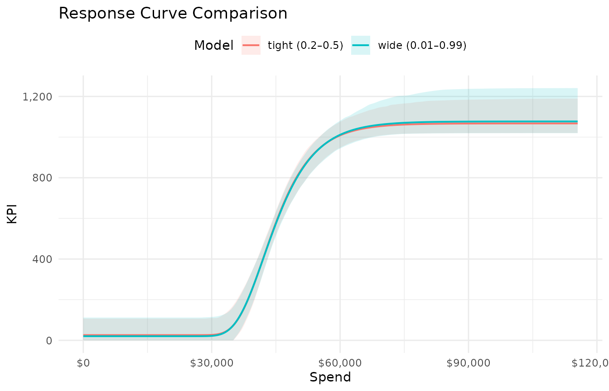

# Priors and Model Tuning

Bayesian models require prior distributions on every parameter. Poor
priors can produce curves that converge numerically but are
scientifically implausible — ceiling estimates ten times the observed
maximum, or midpoints far outside the data range. This vignette explains
how `mrmopt`’s prior system works and how to tune it when the default
fit is unsatisfactory.

------------------------------------------------------------------------

## The three-tier prior system

`mrmopt` offers three levels of prior control. Most users should work at
the simplified level.

### 1. Automatic (default)

When `auto = TRUE` (the default in
[`fit_response()`](https://bdshaff.github.io/mrmopt/reference/fit_response.md)),
priors are generated automatically based on the observed data range.
This is a reasonable starting point but uses wide defaults that may be
too permissive for some channels.

### 2. Simplified via `mrmopt_prior()`

The recommended approach for most workflows.
[`mrmopt_prior()`](https://bdshaff.github.io/mrmopt/reference/mrmopt_prior.md)
lets you constrain the four curve parameters using intuitive,
scale-invariant inputs:

``` r

my_prior <- mrmopt_prior(
  midpoint_range = c(0.2, 0.6),
  ceiling_max    = 2.5,
  floor_min      = 0,
  anchor_strength = 0.05
)
my_prior
#> mrm_prior specification:
#>   midpoint range : [0.2, 0.6] (x-axis fraction)
#>   ceiling max    : 2.5 x observed max of y
#>   floor min      : 0 (original data units)
#>   anchor strength: 0.05 (fraction of y range)
```

These translate to Stan priors internally — you do not need to know the
scaled parameter space.

### 3. Manual via `brms::prior()`

For advanced users who want full control. Pass a raw `brmsprior` object
to the `prior` argument of
[`fit_response()`](https://bdshaff.github.io/mrmopt/reference/fit_response.md).
When doing this with `auto = FALSE` and `scale_data = FALSE`, you take
full responsibility for the prior specification.

------------------------------------------------------------------------

## What each prior control does

### `midpoint_range` — where the inflection falls

A two-element vector giving the lower and upper bound for the inflection
point as a fraction of the x-axis (spend) range. For example,
`c(0.2, 0.6)` means the inflection must fall between the 20th and 60th
percentile of observed spend.

This is the most impactful prior control. A tight `midpoint_range`
anchors the curve’s shape to a plausible region:

- **Too wide** (e.g., `c(0.01, 0.99)`): The model may place the
  inflection far outside the observed data, producing a nearly linear
  fit.
- **Too narrow** (e.g., `c(0.3, 0.35)`): Overly informative — the data
  has little room to speak.
- **Good default**: `c(0.1, 0.5)` for channels where you expect
  diminishing returns to be visible within the observed spend range.
  Widen toward `c(0.1, 0.9)` if unsure.

``` r

ps_data <- mrmopt_data |> filter(channel == "Paid Search")

fit_tight <- fit_response(
  data           = ps_data,
  spend          = "spend",
  kpi            = "conversions",
  date           = "week",
  type           = "gompertz",
  midpoint_range = c(0.2, 0.5),
  ceiling_max    = 3,
  refresh        = 0,
  iter = 1000,
  chains = 2
)
#> conversions ~ c + (d - c) * exp(-exp(b * (spend - e))) 
#> b ~ 1
#> c ~ 1
#> d ~ 1
#> e ~ 1
```

``` r

fit_wide <- fit_response(
  data           = ps_data,
  spend          = "spend",
  kpi            = "conversions",
  date           = "week",
  type           = "gompertz",
  midpoint_range = c(0.01, 0.99),
  ceiling_max    = 5,
  refresh        = 0,
  iter = 1000,
  chains = 2
)
#> conversions ~ c + (d - c) * exp(-exp(b * (spend - e))) 
#> b ~ 1
#> c ~ 1
#> d ~ 1
#> e ~ 1
```

``` r

mrms_plot_compare(
  list("tight (0.2–0.5)" = fit_tight, "wide (0.01–0.99)" = fit_wide),
  interval = "confidence"
)
```



The tighter prior produces a more clearly identified curve. The wider
prior allows the credible band to expand substantially, particularly at
the extremes of the spend range.

------------------------------------------------------------------------

### `ceiling_max` — how high the curve can reach

A multiplier on the observed maximum of the KPI column.
`ceiling_max = 3` means the ceiling parameter `d` can be at most 3× the
highest observed weekly conversions.

- **Too low** (e.g., `1.1`): Forces the ceiling close to the observed
  max, which may be appropriate if you believe the channel is near
  saturation, but can produce a poor fit if the data doesn’t clearly
  plateau.
- **Too high** (e.g., `10`): Allows implausibly large ceilings. The
  posterior may settle on a high ceiling with a far-off midpoint,
  producing a curve that looks linear in-sample.
- **Good default**: `2` to `3` for most channels. Lower if the data
  clearly shows a plateau; higher for channels where you believe
  substantial headroom remains.

------------------------------------------------------------------------

### `floor_min` — baseline KPI at zero spend

The lower asymptote `c` in original units. Defaults to `0`, meaning the
model assumes zero conversions at zero spend. Set this higher if you
have organic conversions that persist without paid media.

``` r

# Channel with known organic baseline of ~50 conversions/week
fit_response(
  ...,
  floor_min = 40   # allow floor between 40 and observed data
)
```

------------------------------------------------------------------------

### `anchor_strength` — how tightly the floor is held

Controls the prior SD on the floor parameter `c` as a fraction of the
observed y range. The default `0.05` (5% of the range) keeps the floor
tightly constrained around `floor_min`, which prevents the curve from
developing an unrealistically high or negative baseline.

- **Smaller values** (e.g., `0.02`): Very tight floor constraint. Use
  when you have strong knowledge of the baseline.
- **Larger values** (e.g., `0.2`): Loose constraint. The floor can move
  substantially from `floor_min`.
- **`NULL`**: No floor constraint beyond the default. Use when you
  genuinely don’t know the baseline.

------------------------------------------------------------------------

## Passing prior controls to `fit_response()`

You can pass `midpoint_range`, `ceiling_max`, `floor_min`, and
`anchor_strength` directly as arguments to
[`fit_response()`](https://bdshaff.github.io/mrmopt/reference/fit_response.md)
— there is no need to create an
[`mrmopt_prior()`](https://bdshaff.github.io/mrmopt/reference/mrmopt_prior.md)
object first:

``` r

fit_response(
  data           = ps_data,
  spend          = "spend",
  kpi            = "conversions",
  date           = "week",
  type           = "gompertz",
  midpoint_range = c(0.15, 0.5),
  ceiling_max    = 2.5,
  floor_min      = 0,
  anchor_strength = 0.03,
  refresh        = 0
)
```

The standalone
[`mrmopt_prior()`](https://bdshaff.github.io/mrmopt/reference/mrmopt_prior.md)
constructor is useful when you want to inspect the prior object or reuse
the same specification across multiple fits.

------------------------------------------------------------------------

## Common tuning scenarios

### The curve looks nearly linear

**Symptom**: The response curve is a gentle slope with no visible
saturation, and the ceiling estimate is very high relative to observed
data.

**Diagnosis**: The model placed the midpoint far to the right of the
observed data. The curve is in its early accelerating phase across the
entire data range.

**Fix**: Tighten `midpoint_range` to force the inflection into the
observed range. Lower `ceiling_max` to prevent runaway ceiling
estimates.

``` r

fit_response(..., midpoint_range = c(0.1, 0.4), ceiling_max = 2)
```

### Wide credible bands

**Symptom**: The posterior band is so wide it’s not informative. The
curve could be nearly flat or steeply rising — the data doesn’t
distinguish.

**Diagnosis**: Usually indicates insufficient spend variation (see [Data
Requirements](https://bdshaff.github.io/mrmopt/articles/response_curve_theory.html#data-requirements))
or overly permissive priors.

**Fix**: First check that the data has adequate spend variation. If so,
tighten `midpoint_range` and `ceiling_max`. If not, more data is needed
— tighter priors will reduce uncertainty cosmetically but not
substantively.

### The floor is negative or unreasonably high

**Symptom**: The fitted `c` parameter is negative (implying negative KPI
at zero spend) or much higher than expected organic baseline.

**Fix**: Set `floor_min` to a sensible value and reduce
`anchor_strength`:

``` r

fit_response(..., floor_min = 0, anchor_strength = 0.02)
```

### Divergent transitions or low ESS

**Symptom**: Stan warnings about divergent transitions, or Bulk ESS \<
400.

**Diagnosis**: The posterior geometry is difficult for the sampler. This
can happen when priors are contradictory, when the data is very sparse,
or when a parameter is weakly identified.

**Fix**: Try in order:

1.  Increase `iter` and `warmup` (e.g., `iter = 4000, warmup = 2000`)
2.  Tighten priors to reduce the posterior’s effective volume
3.  Try a different curve type — some curve forms fit certain data
    shapes more naturally
4.  Increase `adapt_delta` via `control = list(adapt_delta = 0.99)`

------------------------------------------------------------------------

## Inspecting the effective priors

To see the actual Stan priors that `mrmopt` generates, fit a model and
examine the `brms` prior specification:

``` r

brms::prior_summary(fit_tight)
#>                 prior class      coef group resp dpar nlpar   lb  ub tag
#>        normal(-4, 10)     b                               b  -10   0    
#>        normal(-4, 10)     b Intercept                     b  -10   0    
#>       normal(0, 0.05)     b                               c -0.2 0.2    
#>       normal(0, 0.05)     b Intercept                     c -0.2 0.2    
#>       normal(1.9, 10)     b                               d  0.8   3    
#>       normal(1.9, 10)     b Intercept                     d  0.8   3    
#>      normal(0.35, 10)     b                               e  0.2 0.5    
#>      normal(0.35, 10)     b Intercept                     e  0.2 0.5    
#>  student_t(3, 0, 2.5) sigma                                    0        
#>        source
#>          user
#>  (vectorized)
#>          user
#>  (vectorized)
#>          user
#>  (vectorized)
#>          user
#>  (vectorized)
#>       default
```

This shows the priors on the scaled parameter space. The mapping between
the simplified controls and these Stan priors depends on the data
scaling, which is why working with the scale-invariant
[`mrmopt_prior()`](https://bdshaff.github.io/mrmopt/reference/mrmopt_prior.md)
interface is recommended.

------------------------------------------------------------------------

## Where to go next

| Topic | Vignette |
|----|----|
| Convergence diagnostics and model comparison | [Diagnostics & Model Comparison](https://bdshaff.github.io/mrmopt/articles/diagnostics_and_comparison.md) |
| Mathematical foundations of the six curve forms | [Response Curve Theory](https://bdshaff.github.io/mrmopt/articles/response_curve_theory.md) |
| Budget optimization across channels | [Optimization](https://bdshaff.github.io/mrmopt/articles/optimization.md) |
